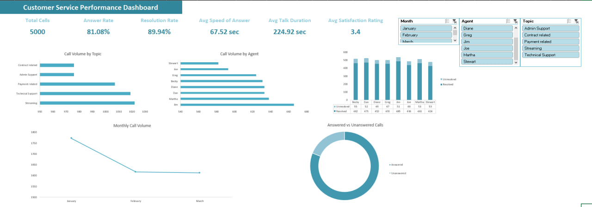
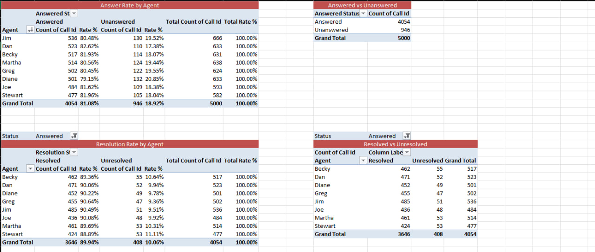
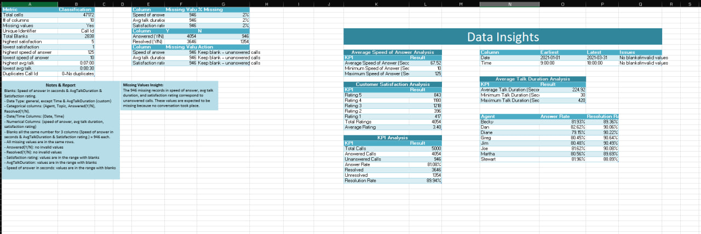

# Customer Service Performance Analysis — Excel

## 📌 Project Overview

This project analyzes customer service call center data using Microsoft Excel to evaluate call volume, agent performance, response speed, resolution rates, and customer satisfaction.

The project follows a practical Data Analyst workflow, including:

- Data validation
- Data cleaning
- KPI analysis
- Excel formulas
- Pivot Tables
- Pivot Charts
- Slicers
- Interactive dashboard development

---

## 🎯 Business Objectives

The analysis focuses on answering the following business questions:

- What percentage of calls are answered?
- What percentage of answered calls are resolved?
- Which agents handle the highest number of calls?
- Which topics generate the most calls?
- What is the average speed of answer?
- What is the average talk duration?
- How satisfied are customers?
- How does call volume change over time?
- How does resolution performance vary by agent?

---

## 🛠️ Tools and Techniques

- Microsoft Excel
- Data Cleaning and Validation
- Excel Formulas
- XLOOKUP
- Pivot Tables
- Pivot Charts
- Slicers
- KPI Analysis
- Interactive Dashboard Design

---

## 📊 Dataset

The dataset contains **5,000 customer service calls** recorded between **January 2021 and March 2021**.

### Main Fields

- Call ID
- Agent
- Date
- Time
- Topic
- Answered
- Resolved
- Speed of Answer
- Average Talk Duration
- Satisfaction Rating

---

## 🧹 Data Cleaning and Validation

The dataset was reviewed and validated for:

- Missing values
- Duplicate Call IDs
- Invalid values
- Category consistency
- Date and time validation
- Satisfaction rating validation
- Speed of answer validation
- Talk duration validation

Missing values in **Speed of Answer**, **Average Talk Duration**, and **Satisfaction Rating** were retained because they correspond to unanswered calls.

---

## 📈 Key Performance Indicators

| KPI | Result |
|---|---:|
| Total Calls | 5,000 |
| Answer Rate | 81.08% |
| Resolution Rate | 89.94% |
| Average Speed of Answer | 67.52 seconds |
| Average Talk Duration | 224.92 seconds |
| Average Satisfaction Rating | 3.40 / 5 |

> **Note:** Resolution Rate is calculated among answered calls.

---

## 🔍 Analysis

### Call Volume by Topic

The analysis compares the number of calls received for each customer service topic. This helps identify the issues that generate the highest demand and may require additional resources or process improvements.

### Call Volume by Agent

The analysis compares the total number of calls handled by each agent. This provides visibility into workload distribution and agent activity.

### Answered vs. Unanswered Calls

The dashboard shows the overall distribution between answered and unanswered calls, helping evaluate call coverage and potential missed-customer opportunities.

### Monthly Call Volume

Call volume is analyzed across:

- January 2021
- February 2021
- March 2021

This helps identify changes in demand over time.

### Resolution Status by Agent

Resolution performance is compared across agents using resolved and unresolved call counts. This helps identify differences in service effectiveness.

---

## 📊 Dashboard

The final Excel dashboard combines the main KPIs, charts, and interactive slicers into one view.

The dashboard includes:

- Total Calls KPI
- Answer Rate KPI
- Resolution Rate KPI
- Average Speed of Answer KPI
- Average Talk Duration KPI
- Average Satisfaction Rating KPI
- Call Volume by Topic
- Call Volume by Agent
- Answered vs. Unanswered Calls
- Monthly Call Volume
- Resolution Status by Agent
- Interactive Agent slicer
- Interactive Topic slicer

---

## 📋 Pivot Table Analysis

The **Pivot Analysis** sheet contains the main analytical summaries used to create the dashboard.

The analysis includes:

- Call volume by topic
- Call volume by agent
- Answered and unanswered calls
- Monthly call volume
- Resolved and unresolved calls by agent
- KPI calculations

---

## 📝 Data Overview

The **Data Overview** sheet documents:

- Dataset structure
- Data-cleaning steps
- Validation checks
- Data-quality findings
- KPI definitions
- Calculation methods
- Key assumptions

---

## 📁 Project Structure

```text
Customer-Service-Analysis/
│
├── Customer_Service_Project.xlsx
├── Customer_Service_Performance_Dashboard.jpg
├── customer_service_performance_DataOverview.jpg
├── customer_service_performance_PivotTables.jpg
└── README.md
```

---

## 💡 Key Takeaways

- The overall answer rate was **81.08%**.
- The resolution rate among answered calls was **89.94%**.
- The average speed of answer was **67.52 seconds**.
- The average talk duration was **224.92 seconds**.
- The average customer satisfaction rating was **3.40 out of 5**.
- Call volume and resolution performance can be analyzed by agent, topic, and month.
- The interactive dashboard allows users to explore the results using Excel slicers.

---

## 📥 Project Files

- 
- 
- 
- 

---

## 🚀 How to Use

1. Download or clone this repository.
2. Open `Customer_Service_Project.xlsx` in Microsoft Excel.
3. Navigate to the **Dashboard** sheet.
4. Use the Agent and Topic slicers to filter the analysis.
5. Review the KPI cards, Pivot Charts, and performance summaries.
6. Explore the **Pivot Analysis** and **Data Overview** sheets for supporting details.

---

## 👤 Author

Mohab Adel

- GitHub: https://github.com/mohabadel10
- LinkedIn: https://www.linkedin.com/in/mohab-adel10m/
